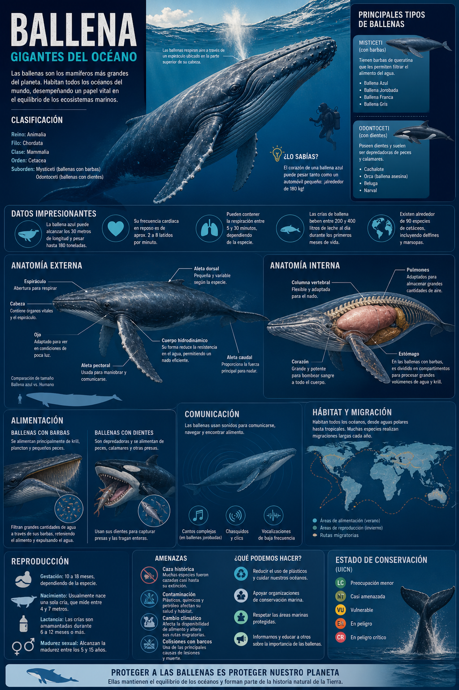
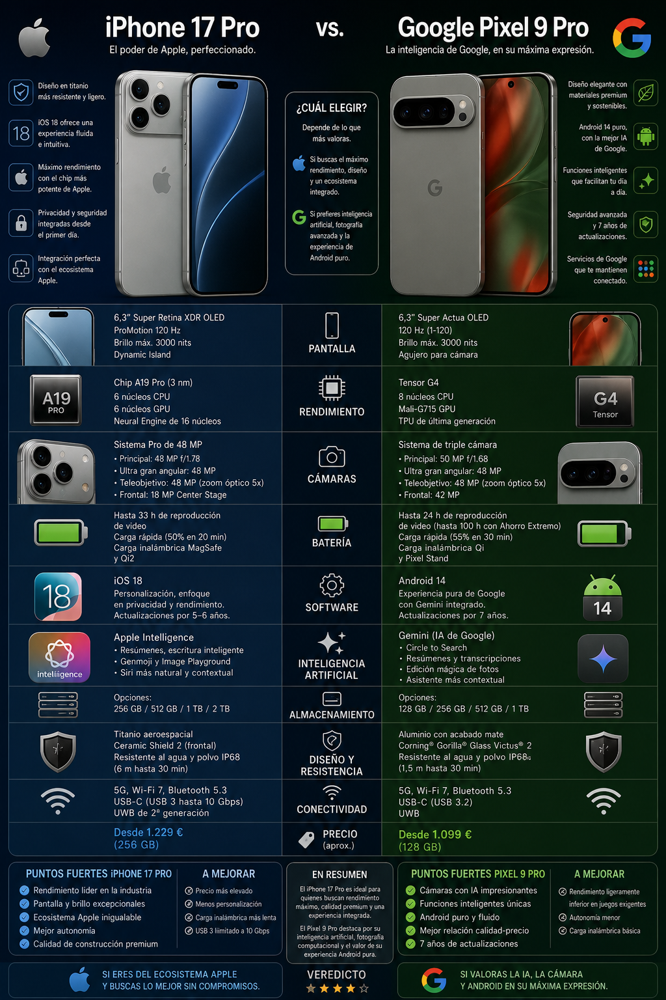

# Bloque 3 · Generación Multimodal
{: .fs-8 }

Crea presentaciones, cómics, infografías, podcasts, audios realistas y vídeos educativos con herramientas de IA generativa para enriquecer tus situaciones de aprendizaje.
{: .fs-5 .fw-300 }


## Objetivos del bloque

Al finalizar este bloque serás capaz de:

1. **Transformar contenidos textuales en recursos multimodales dinámicos** (presentaciones, infografías, cómics, audios realistas, vídeos con avatares) que potencien la atención visual y auditiva en ESO/Bachillerato.
2. Diseñar **presentaciones educativas completas** con Gamma y compararlas con las generadas por Copilot en PowerPoint.
3. Crear **cómics, infografías e ilustraciones** adaptados a cada etapa educativa usando herramientas de IA generativa.
4. Generar **audios realistas** (narración, podcasts, explicaciones) para hacer accesibles los contenidos a todo el alumnado.
5. Producir **vídeos educativos cortos** con avatares IA y edición asistida.
6. **Personalizar el aprendizaje mediante IA**, ajustando materiales multimodales a la diversidad de niveles y realidades del aula de forma rápida y escalable.
7. Integrar todos estos recursos en **situaciones de aprendizaje LOMLOE** respetando los principios del **DUA** (múltiples medios de representación).

> **⚠️ Seguridad GVA:** Las herramientas de generación multimodal que veremos en este bloque son **externas al ecosistema GVA**. Nunca subas fotografías del alumnado, datos personales ni documentos internos. Usa solo contenido ficticio o con licencia abierta como material de partida.

---

## 3.1 · Presentaciones educativas con IA: Gamma y Copilot en PowerPoint

### 3.1.1 · Gamma: presentaciones desde un prompt

**Gamma** ([gamma.app](https://gamma.app)) es una herramienta de IA que genera presentaciones, documentos y páginas web completas a partir de una descripción en lenguaje natural. Ofrece diseños visuales modernos sin necesidad de plantillas previas.

>  🎁 **Acceso a Gamma (invitación)**
> Puedes unirte directamente desde este enlace: [INVITACIÓN](https://gamma.app/workspaces/ef1fs84es7tf0g1/join?code=6esccgwc6yh76gt)


| Característica | Gamma | Copilot en PowerPoint |
|:---------------|:-----:|:---------------------:|
| Acceso | Gratuito (con marca de agua) / Pro | Licencia Microsoft 365 GVA |
| Datos dentro del entorno GVA | ❌ | ✅ |
| Calidad visual por defecto | ⭐⭐⭐⭐⭐ | ⭐⭐⭐ |
| Personalización de diseño | Alta (temas, fuentes, colores) | Media (plantillas Office) |
| Imagen generada automáticamente | ✅ (incluye imágenes IA) | ✅ (Bing Image Creator) |
| Exportación a .pptx | ✅ | ✅ (nativo) |
| Idioma español/valenciano | Bueno | Muy bueno |
| Mejor para… | Presentaciones visuales impactantes | Integración con documentos Word ya existentes |

> ⭐ Gamma funciona mejor cuando el prompt concreta la etapa, el nivel del alumnado, el objetivo didáctico, la estructura de la presentación y el estilo visual. No es lo mismo diseñar para Infantil que para FP: cambian el lenguaje, el ritmo, la cantidad de texto y el tipo de interacción.

### Ejemplo de prompt: Presentación educativa con IA (genérico)

```text
Actúa como un diseñador de presentaciones educativas especializado en crear materiales claros, visuales y adaptados al alumnado.

## Contexto

Necesito una presentación para:
- Asignatura: [ASIGNATURA]
- Curso/Nivel: [CURSO / ETAPA]
- Tema: [TEMA]

## Objetivo didáctico

El alumnado debe comprender:
[OBJETIVO DE APRENDIZAJE]

## Tarea

Crea una presentación de [NÚMERO] diapositivas con la siguiente estructura:

1. Portada con título atractivo e imagen sugerida.
2. Pregunta motivadora o situación inicial.
3. Desarrollo del contenido en varias diapositivas (una idea clave por diapositiva).
4. Ejemplos claros y cercanos al alumnado.
5. Una actividad interactiva o pregunta para el alumnado.
6. Resumen final con ideas clave.
7. (Opcional) Bibliografía o recursos.

## Requisitos

- Lenguaje adaptado al nivel indicado.
- Máximo [X] palabras por diapositiva.
- Incluir sugerencias visuales en cada diapositiva [IMAGEN: ...].
- Usar listas claras, evitar párrafos largos.
- Incluir iconos o elementos visuales cuando sea posible.
- Mantener coherencia visual y pedagógica.

## Formato de salida

DIAPOSITIVA 1: Título
- Texto: …
- Imagen sugerida: …

DIAPOSITIVA 2: …

## Estilo

[Ej: visual, minimalista, científico, colorido, profesional…]

## Restricciones

- No incluir texto excesivo.
- No usar lenguaje demasiado técnico si no es necesario.
- Adaptar ejemplos al contexto del alumnado.
```

### Ejemplo de prompt: Presentación con Copilot en PowerPoint

Si prefieres trabajar directamente en el ecosistema Microsoft:


```text
Crea una presentación sobre "[TEMA]" para [CURSO / NIVEL], asignatura de [ASIGNATURA].

Estructura:
- Portada con título y subtítulo claro.
- Diapositiva 2: pregunta motivadora o situación inicial.
- Desarrollo del contenido en [NÚMERO] diapositivas (una idea clave por diapositiva).
- Diapositiva con ejemplos prácticos o casos reales.
- Diapositiva con actividad para el alumnado.
- Diapositiva final con resumen (3-5 ideas clave) y una pregunta de reflexión.

Requisitos por diapositiva:
- Título claro.
- 3-4 puntos clave en formato lista.
- Imagen sugerida relacionada con el contenido.
- Lenguaje adaptado al nivel del alumnado.

Estilo:
- Claro, visual y estructurado.
- Evitar párrafos largos.
- Usar esquemas, tablas o comparativas cuando sea útil.

Restricciones:
- Máximo [X] palabras por diapositiva.
- No usar lenguaje excesivamente técnico sin explicación.
- Mantener coherencia entre diapositivas.
```

> **🚀 Reto:** Genera la misma presentación en Gamma, ChatGPT y Copilot PowerPoint. Compara: ¿qué herramienta tiene mejor diseño visual? ¿Cuál organiza mejor los contenidos? ¿Cuál es más precisa en los contenidos históricos? ¿Cuál exporta mejor a PDF para compartir por Aules?

💡 También puedes crear presentaciones educativas con IA usando herramientas <a href="https://www.kimi.com/">Kimi</a>, útiles para generar estructuras, guiones, contenidos visuales y presentaciones completas a partir de texto.


## Actividades de presentaciones por etapa

Para facilitar la navegación, las actividades de creación de presentaciones educativas con IA se han separado por etapa. En esta página dejamos los prompts generales y la comparativa de herramientas, y las actividades completas quedan enlazadas en sus páginas correspondientes.

- [Educación Infantil](bloque3-actividad-infantil.md)
- [Educación Primaria](bloque3-actividad-primaria.md)
- [Educación Secundaria](bloque3-actividad-secundaria.md)
- [Formación Profesional](bloque3-actividad-fp.md)
- [Escuela Oficial de Idiomas](bloque3-actividad-eoi.md)
  

---

## 3.2 · Cómics e ilustraciones educativas con IA

Los cómics son una herramienta pedagógica potente: combinan narrativa visual y textual, favorecen la comprensión lectora y conectan con el alumnado de todas las edades. Con IA generativa puedes crearlos sin saber dibujar.

### 3.2.1 · Herramientas recomendadas

| Herramienta | Tipo | Acceso | Ideal para |
|---|---|---|---|
| 🔷 Gemini | 🖼️ Multimodal + imágenes | Cuenta Google (⚠️ sin datos del alumnado) | Ilustraciones complejas, escenas ricas y generación visual avanzada *(funciones recientes; verificar disponibilidad)* |
| 💬 ChatGPT | 🎨 Imágenes + guion | Cuenta OpenAI externa (⚠️ sin datos personales) | Cómics, viñetas, ilustraciones educativas y mejora de prompts |
| 🟦 Copilot | 🎨 Imágenes (DALL·E) | ✅ `@edu.gva.es` (🔒 entorno GVA) | Ilustraciones, portadas, infografías con mayor seguridad |
| 📚 NotebookLM | 🧠 Análisis + guion | Cuenta Google (⚠️ solo contenido no sensible) | Guiones de cómic y transformación de apuntes en narrativa visual |
| 🧍 Pixton | 🗨️ Cómics con avatares | Freemium / cuenta externa | Cómics con personajes, diálogos y escenas guiadas |
| 🎨 Canva + IA | 🖌️ Diseño + IA | Freemium / Educación (cuenta externa) | Cómics, pósteres, infografías y maquetación final |
| 🧩 Kimi | ✍️ Texto + apoyo visual | Cuenta externa | Descripción de viñetas y estructuración de escenas |
| 📊 Gamma | 📑 Presentaciones IA | Freemium / cuenta externa | Convertir ideas en materiales visuales estructurados |
| 🧠 Napkin AI | 🔗 Esquemas visuales | Freemium / cuenta externa | Transformar apuntes en diagramas e infografías |
| 🧪 Google Labs / Flow | 🎬 Imagen + vídeo experimental | Cuenta Google (⚠️ variable) | Animar infografías y recursos visuales *(funciones recientes; verificar disponibilidad)* |

<div style="background-color:#f5f7fa; border-left:4px solid #6c8ebf; padding:12px 14px; margin:18px 0; border-radius:6px;">

💭 <strong>Para pensar</strong><br>
No todas las tareas educativas se benefician del uso de IA.
En algunos casos, especialmente cuando hay decisiones importantes o procesos de aprendizaje clave, puede ser más adecuado no utilizarla.

</div>

### Ejemplo de prompt: Generar la ilustración de una viñeta con Copilot

```text
Genera una ilustración estilo cómic educativo para niños de 8-9 años. 
La escena muestra un aula de Primaria donde una profesora explica el 
sistema solar. En la pizarra hay un dibujo de los planetas. Tres alumnos 
levantan la mano con entusiasmo. Colores vivos, estilo cartoon amigable. 
No incluyas texto ni letras en la imagen.
```
>💡 Este mismo prompt puede usarse en ChatGPT para generar la imagen directamente.

> **⚠️ Seguridad GVA:** Copilot Chat con tu cuenta `@edu.gva.es` incluye generación de imágenes con IA (sujeto a disponibilidad y configuración del tenant) con filtros de contenido corporativo. Es la opción más segura para generar imágenes. **Nunca pidas que genere imágenes que se parezcan a personas reales, alumnado concreto o menores identificables.**

### Ejemplo de prompt: Guion de cómic educativo (para cualquier herramienta)

Usa este prompt para generar el **guion** del cómic, y después crea las imágenes viñeta a viñeta:

```text
Actúa como un guionista de cómics educativos especializado en crear materiales para alumnado de [Nivel/Etapa].

## Objetivo

Crear un cómic educativo de [NUM] viñetas para explicar [Tema], relacionado con [Área o materia], adaptado al nivel madurativo, lingüístico y curricular del alumnado de [Nivel/Etapa].

## Contexto educativo

El cómic debe poder utilizarse como recurso didáctico en el aula dentro de [Asignatura/Área], siguiendo el enfoque competencial de [Normativa o marco educativo] en [Territorio/Comunidad].

## Tarea

Escribe el guion completo del cómic siguiendo esta estructura en cada viñeta:

### VIÑETA [N]

- Escena: Descripción visual detallada de la situación, el lugar, los objetos importantes y la acción principal.
- Personajes: Personajes ficticios que aparecen, qué hacen, qué sienten y cómo interactúan.
- Diálogo/Texto: Bocadillos, cartelas o textos breves. El lenguaje debe estar adaptado a [Edad o nivel].
- Emoción: Tono de la viñeta: curiosidad, sorpresa, humor, tensión, cooperación, descubrimiento, reflexión, etc.
- Idea clave: Aprendizaje principal que transmite la viñeta.

## Restricciones

- Los personajes deben ser ficticios y adecuados para un contexto escolar.
- No uses personajes reales, famosos ni marcas comerciales.
- El lenguaje debe ser claro, cercano y adaptado a [Nivel/Etapa].
- Cada viñeta debe tener una función narrativa o didáctica clara.
- El cómic debe combinar aprendizaje, diálogo y elementos visuales atractivos.
- La última viñeta debe cerrar con una conclusión, mensaje reflexivo o pregunta abierta.
- Evita textos extensos dentro de los bocadillos.

## Formato de salida

Presenta el resultado en formato de guion, dividido por viñetas, con apartados claros y ordenados.
```

### Actividades de cómic por etapa

Para facilitar la navegación, las actividades de cómic educativo se han separado por etapa. En esta página dejamos un ejemplo destacado de FP como modelo, y el resto de actividades completas quedan enlazadas.

- [Educación Infantil](bloque3-actividad-infantil.md)
- [Educación Primaria](bloque3-actividad-primaria.md)
- [Educación Secundaria](bloque3-actividad-secundaria.md)
- [Formación Profesional](bloque3-actividad-fp.md)
- [Escuela Oficial de Idiomas](bloque3-actividad-eoi.md)

---
## 3.2b · Cómic con NotebookLM
NotebookLM también puede utilizarse como herramienta de apoyo para generar guiones de cómic a partir de fuentes propias (apuntes, documentos, normativa, etc.), lo que permite crear materiales totalmente contextualizados.

Flujo de trabajo
- Sube a NotebookLM las fuentes que quieres utilizar para crear el cómic (apuntes, documentos, textos, etc.).
- Genera un prompt maestro como nota dentro del entorno. 

### 🏆 Prompt maestro: Guion de cómic con NotebookLM

```text
Eres un Guionista y Director Visual especializado en cómic profesional. Tu trabajo es convertir una idea en un guion listo para ilustrarse con IA o por un dibujante real. Antes de escribir, pregunta de forma breve y una a una por: concepto central, público, extensión aproximada, estilo artístico, tono e idioma, y descripción física detallada de cada personaje (rasgos, vestimenta, edad, accesorios). No empieces el guion hasta tener todo definido. Cuando lo desarrolles, estructura por páginas y viñetas, especifica tipo de plano y ángulo (primer plano, contrapicado, panorámica…), iluminación y atmósfera, y redacta descripciones visuales completas repitiendo siempre los rasgos físicos del personaje para mantener coherencia visual. Entrega el resultado en Markdown, con portada opcional y cada viñeta claramente separada.

````

- Contestamos a las preguntas que nos haga y nos dará como resultado el guión escrito con los personajes
- Selecciona el icono de la chincheta → Guardar como nota (aparecerá en la parte derecha).
- Pulsa los tres puntos → Convertir en fuente.
- Deja solo esa fuente seleccionada en el panel izquierdo.
- En el chat escribe: “Con la presentación del cuaderno, crea la versión final del cómic con la maquetación de las viñetas listo para leer”.


💡 Consejo: Este flujo convierte el prompt en una “regla interna” del modelo, asegurando coherencia en todo el cómic sin tener que repetir instrucciones en cada interacción.


---
## 3.2c · Infografías educativas con IA

Las infografías son uno de los recursos más eficaces para sintetizar información compleja de forma visual. Con IA puedes generarlas rápidamente a partir de cualquier contenido textual.

### Herramientas recomendadas para infografías

| Herramienta | Tipo | Acceso | Ideal para |
|:------------|:-----|:-------|:-----------|
| **Canva + IA** | Diseño gráfico + IA generativa | Freemium (plan educativo gratuito) | Infografías con plantillas profesionales, datos y gráficos |
| **Gamma** | Generador de documentos/presentaciones | Freemium | Infografías tipo página web con datos y visualizaciones |
| **Copilot + PowerPoint** | Diseño integrado en M365 | ✅ Cuenta `@edu.gva.es` | Infografías dentro de presentaciones, entorno GVA seguro |
| **Napkin AI** | Conversor de texto a infografía | Freemium | Transformar textos largos en esquemas visuales automáticos |

### Ejemplo de prompt: Transformar un texto en infografía

```text
Actúa como un diseñador de infografías educativas para alumnado de [Nivel educativo].

Contexto: Necesito transformar el siguiente texto de apuntes de 
[TU ASIGNATURA] ([CURSO]) en una infografía visual y atractiva.

Texto a transformar:
[PEGAR AQUÍ EL TEXTO O RESUMEN DEL TEMA]

Tarea: Diseña la estructura de una infografía que incluya:
1. Título principal llamativo.
2. 4-6 secciones con iconos descriptivos y texto breve (máx. 20 palabras 
   por sección).
3. Un diagrama o esquema visual central que conecte los conceptos clave.
4. Datos destacados en recuadros de color (cifras, fechas, fórmulas).
5. Una sección "¿Sabías que...?" con un dato curioso.
6. Paleta de colores sugerida (3 colores máximo).

Formato: Descripción detallada de cada sección, lista para
recrearse en Canva o PowerPoint. Incluye sugerencias de 
iconos entre corchetes [ICONO: ...].

Restricciones: Lenguaje adaptado a 14-17 años. No más de 150 
palabras totales en la infografía (es visual, no textual).
```

> **💡 Flujo de trabajo rápido:** 1) Genera la estructura con Copilot → 2) Crea la infografía en Canva usando la descripción como guía → 3) Exporta en PDF y sube a Aules.


### Podemos generar infografías con Chat GPT con dos líneas
### o con NotebookLM presionando un botón sobre nuestro material


 Chat GPT: Crea una infografía muy detallada sobre una ballena



Chat GPT: Haz una infografía comparando un iphone con un google pixel



📂 Carpeta compartida de infografías educativas:  
https://drive.google.com/drive/folders/1P2TQxmyKvDVaw5g77_0qg911KCRfD3-V?usp=sharing


## Infografías interactivas

Prompt para generar infografía con ChatGPT o Gemini

```text
Animate this vertical 9:16 premium educational infographic poster about [SUBJECT NAME] into a smooth professional science explainer reel.
Keep the same exact poster layout, same central [SUBJECT NAME], same headline, same infographic panels, same expert presenter character, same background, same colors, and same composition. Do not change the design, do not replace the subject, and do not add random objects.
Start with the full infographic poster visible in a clean front-facing view. Use a slow gentle camera push-in with very subtle parallax depth between the central subject, callout panels, connector lines, presenter character, and background.
First, animate the top headline and subtitle with a smooth fade-in and slight slide-down motion.
Then animate the main [SUBJECT NAME] with subtle natural idle movement based on the creature, such as tiny breathing motion, slight head movement, eye blink, soft feather shimmer, gentle tentacle movement, tiny tail movement, subtle body shift, or slow fin movement.
The subject should remain mostly stable and realistic, not overanimated.
Next, animate the infographic connector lines drawing outward from the body parts to the information panels. Reveal the callout panels one by one using soft scale-up and fade-in animation.
Small icons, numbered badges, mini diagrams, circular thumbnails, and chart elements inside the panels should pop in smoothly with clean motion-graphics timing.
Add subtle highlight pulses on important body parts when their panel appears.
The expert presenter character should make a minimal presenter gesture, such as a small arm movement, pointing gesture, slight head nod, or tiny posture shift, while staying in the same position.
The bottom quick facts strip should reveal near the end with smooth slide-in motion, small icon pop-ups, and subtle highlight animation.
Keep the animation clean, premium, educational, modern, social-media optimized, bright, polished, readable, and smooth.
Use bright studio lighting, soft shadows, crisp highlights, realistic 3D subject details, clean infographic UI, and modern science-poster aesthetics.
End with a clean final hold shot showing the full completed infographic clearly.
Negative prompt: camera shake, fast zoom, scene change, subject morphing, text distortion, flickering panels, broken infographic layout, random extra objects, messy animation, distorted body parts, warped callout lines, low quality, dark lighting, excessive movement, chaotic transitions, unreadable text, bad typography, unstable parallax.
```
### Ejemplo de uso: Mariposa

Vamos a [Google Labs FLOW](https://labs.google/fx/tools/flow)


### Prompt para darle vida

```text
Animate this vertical 9:16 premium educational infographic poster about [SUBJECT NAME] into a smooth professional science explainer reel.
Keep the same exact poster layout, same central [SUBJECT NAME], same headline, same infographic panels, same expert presenter character, same background, same colors, and same composition. Do not change the design, do not replace the subject, and do not add random objects.
Start with the full infographic poster visible in a clean front-facing view. Use a slow gentle camera push-in with very subtle parallax depth between the central subject, callout panels, connector lines, presenter character, and background.
First, animate the top headline and subtitle with a smooth fade-in and slight slide-down motion.
Then animate the main [SUBJECT NAME] with subtle natural idle movement based on the creature, such as tiny breathing motion, slight head movement, eye blink, soft feather shimmer, gentle tentacle movement, tiny tail movement, subtle body shift, or slow fin movement.
The subject should remain mostly stable and realistic, not overanimated.
Next, animate the infographic connector lines drawing outward from the body parts to the information panels. Reveal the callout panels one by one using soft scale-up and fade-in animation.
Small icons, numbered badges, mini diagrams, circular thumbnails, and chart elements inside the panels should pop in smoothly with clean motion-graphics timing.
Add subtle highlight pulses on important body parts when their panel appears.
The expert presenter character should make a minimal presenter gesture, such as a small arm movement, pointing gesture, slight head nod, or tiny posture shift, while staying in the same position.
The bottom quick facts strip should reveal near the end with smooth slide-in motion, small icon pop-ups, and subtle highlight animation.
Keep the animation clean, premium, educational, modern, social-media optimized, bright, polished, readable, and smooth.
Use bright studio lighting, soft shadows, crisp highlights, realistic 3D subject details, clean infographic UI, and modern science-poster aesthetics.
End with a clean final hold shot showing the full completed infographic clearly.
Negative prompt: camera shake, fast zoom, scene change, subject morphing, text distortion, flickering panels, broken infographic layout, random extra objects, messy animation, distorted body parts, warped callout lines, low quality, dark lighting, excessive movement, chaotic transitions, unreadable text, bad typography, unstable parallax.
```
Prompt para IMAGEN 
```text
Crea un póster infográfico educativo premium en formato vertical 9:16 sobre [NOMBRE DEL SUJETO], diseñado como un explicador científico moderno de alta gama para Instagram Reels, combinando un gran render 3D realista de un animal/criatura con un diseño infográfico limpio.

Usa un fondo limpio blanco, gris claro o neutro suave, con iluminación brillante de estudio, sombras suaves, detalles nítidos y una composición editorial premium.

En la parte superior, coloca un titular muy grande en mayúsculas y negrita sobre [NOMBRE DEL SUJETO], con un subtítulo breve que explique sus rasgos biológicos únicos, adaptaciones, mecanismos de defensa, comportamiento en su hábitat y ventajas evolutivas.

En el centro, coloca un gran [NOMBRE DEL SUJETO] en 3D realista y muy detallado como protagonista principal, dominando el encuadre con anatomía precisa, textura detallada de piel/plumas/escamas/concha, colores naturales intensos, reflejos limpios de estudio y una pose fuerte e impresionante.

Alrededor del sujeto, crea entre 4 y 6 paneles infográficos limpios con esquinas redondeadas, sombras suaves, insignias numeradas, pequeños iconos, mini diagramas, miniaturas circulares y líneas conectoras finas que apunten a diferentes partes del cuerpo.

Los paneles deben explicar anatomía, adaptación especial, mecanismo de defensa, movimiento, sistema sensorial, camuflaje, estilo de caza, alimentación, hábitat, papel en el ecosistema o biología única.

Añade un pequeño personaje experto presentador cerca de la parte inferior derecha o izquierda, adaptado al tema del sujeto, como un biólogo marino, experto en fauna, explorador, buceador o científico, de pie y señalando hacia el sujeto mientras sostiene un portapapeles, una lupa, unos prismáticos o una tableta.

En la parte inferior, añade una franja de información limpia con datos rápidos, tarjetas comparativas, miniaturas de especies, iconos, símbolos de hábitat y rasgos clave.

Usa una paleta de colores que combine de forma natural con [NOMBRE DEL SUJETO], con colores de acento complementarios como azul, turquesa, verde, naranja, morado, amarillo o rojo.

El diseño completo debe sentirse educativo, fascinante, premium, inteligente, limpio, cinematográfico, preparado para volverse viral en reels, muy legible, equilibrado, moderno y diseñado de forma profesional.

Prompt negativo: baja calidad, borroso, diseño desordenado, texto ilegible, tipografía distorsionada, mala anatomía, animal deformado, extremidades extra, partes del cuerpo rotas, proporciones incorrectas, fondo recargado, iluminación oscura, diseño plano, mala alineación infográfica, objetos aleatorios, aspecto de póster barato, marca de agua, logotipo, mal recorte, exceso de texto, composición caótica, pixelado, etiquetas mal escritas, sujeto duplicado, anatomía irreal.
```

Prompt para VÍDEO
```text
Anima este póster infográfico educativo premium en formato vertical 9:16 sobre [NOMBRE DEL SUJETO] y conviértelo en un reel explicativo científico profesional, fluido y elegante.

Mantén exactamente el mismo diseño del póster, el mismo [NOMBRE DEL SUJETO] central, el mismo titular, los mismos paneles infográficos, el mismo personaje experto presentador, el mismo fondo, los mismos colores y la misma composición. No cambies el diseño, no sustituyas el sujeto y no añadas objetos aleatorios.

Comienza con el póster infográfico completo visible en una vista frontal limpia. Usa un acercamiento de cámara lento y suave, con una profundidad de paralaje muy sutil entre el sujeto central, los paneles explicativos, las líneas conectoras, el personaje presentador y el fondo.

Primero, anima el titular superior y el subtítulo con un fundido de entrada suave y un ligero movimiento descendente.

Después, anima el [NOMBRE DEL SUJETO] principal con un movimiento natural y sutil de reposo, adaptado al tipo de sujeto, como una pequeña respiración, un ligero movimiento de cabeza, parpadeo, brillo suave en las plumas, movimiento delicado de tentáculos, pequeño movimiento de cola, desplazamiento corporal sutil o movimiento lento de aletas.

El sujeto debe permanecer principalmente estable y realista, sin estar sobreactuado ni excesivamente animado.

A continuación, anima las líneas conectoras de la infografía dibujándose hacia fuera desde las partes del cuerpo hasta los paneles informativos. Revela los paneles explicativos uno por uno usando una animación suave de escala y fundido de entrada.

Los pequeños iconos, insignias numeradas, mini diagramas, miniaturas circulares y elementos gráficos dentro de los paneles deben aparecer suavemente con un timing limpio de motion graphics.

Añade pulsos de luz sutiles en las partes importantes del cuerpo cuando aparezca su panel correspondiente.

El personaje experto presentador debe hacer un gesto mínimo de presentación, como un pequeño movimiento de brazo, un gesto de señalar, una ligera inclinación de cabeza o un pequeño cambio de postura, permaneciendo siempre en la misma posición.

La franja inferior de datos rápidos debe revelarse cerca del final con un movimiento suave de deslizamiento, pequeños iconos apareciendo con pop-up y una animación de resaltado sutil.

Mantén la animación limpia, premium, educativa, moderna, optimizada para redes sociales, brillante, pulida, legible y fluida.

Usa iluminación de estudio brillante, sombras suaves, reflejos nítidos, detalles realistas del sujeto 3D, una interfaz infográfica limpia y estética moderna de póster científico.

Termina con un plano final limpio y estable que muestre claramente la infografía completa terminada.

Prompt negativo: cámara temblorosa, zoom rápido, cambio de escena, transformación del sujeto, distorsión del texto, paneles parpadeantes, diseño infográfico roto, objetos aleatorios extra, animación desordenada, partes del cuerpo distorsionadas, líneas conectoras deformadas, baja calidad, iluminación oscura, movimiento excesivo, transiciones caóticas, texto ilegible, mala tipografía, paralaje inestable.
```

Prompt para IMAGEN (Optimizado)

```text
Póster infográfico 9:16 estilo “educational science explainer” premium sobre [NOMBRE DEL SUJETO]. Fondo neutro limpio, iluminación de estudio y renderizado 3D realista central con anatomía precisa y texturas detalladas. Diseño editorial moderno: titular gigante en negrita arriba con subtítulo biográfico. Alrededor del sujeto, 4–6 paneles limpios con bordes redondeados, iconos, mini-diagramas y líneas conectoras finas a partes del cuerpo. Incluye un pequeño personaje experto (biólogo/explorador) señalando al sujeto con una tableta o lupa. En la base, franja de datos rápidos y tarjetas de comparación. Paleta de colores acorde al espécimen con acentos vibrantes. Estilo viral, ultra legible, cinematográfico y profesional.
```

Prompt para VÍDEO (Optimizado)
```text
Anima este póster infográfico 9:16 de [NOMBRE DEL SUJETO] como un reel profesional fluido. Mantén diseño, sujeto, texto y composición exactos. Cámara con avance lento (push-in) y paralaje sutil. Animación: 1. Fade-in suave del titular. 2. Movimiento orgánico de “reposo” en el sujeto (respiración, parpadeo o aletas) sin exagerar. 3. Líneas conectoras dibujándose hacia afuera. 4. Paneles de datos apareciendo en escala/fade con motion graphics limpios en iconos. 5. Gesto mínimo del presentador (asentimiento o señalar). 6. Franja inferior deslizándose al final. Acabado brillante, pulido, educativo y premium. Termina en toma estática completa.
```
---

## 3.3 · Audios realistas: narración, podcasts y accesibilidad

La generación de audio con IA tiene un enorme potencial educativo: desde hacer accesibles los apuntes para alumnado con dificultades de lectura hasta crear podcasts de repaso.

### 3.3.1 · Herramientas de texto a voz (TTS) con IA

| Herramienta | Calidad de voz | Español | Valenciano | Gratuito | Mejor para |
|:------------|:--------------:|:-------:|:----------:|:--------:|:-----------|
| **ElevenLabs** | ⭐⭐⭐⭐⭐ (muy realista) | ✅ | Limitado | Freemium (10 min/mes) | Narraciones, audiolibros, personajes |
| **NotebookLM Audio Overviews** | ⭐⭐⭐⭐ (formato podcast) | ✅ | ❌ | ✅ Gratuito | Resúmenes de documentos, divulgación |
| **Microsoft Edge (Leer en voz alta)** | ⭐⭐⭐ | ✅ | ✅ | ✅ Gratuito | Lectura accesible de textos en el navegador |
| **Natural Reader** | ⭐⭐⭐⭐ | ✅ | Limitado | Freemium | Convertir PDF y documentos a audio |
| **Copilot (lectura de respuestas)** | ⭐⭐⭐ | ✅ | Parcial | ✅ Con licencia GVA | Escuchar respuestas generadas directamente |

### Ejemplo de prompt: Guion para narración educativa (ElevenLabs)

Primero genera el guion con Copilot o Gemini, y luego copia el texto en ElevenLabs para convertirlo a audio:

```text
Actúa como un narrador de audiolibros educativos para niños de 6.º de Primaria.

Contexto: Estoy creando material de apoyo en audio para alumnado con 
dificultades de lectoescritura. Tema: "La Edad Media en la Península Ibérica" 
(área de Conocimiento del Medio, LOMLOE, Comunitat Valenciana).

Tarea: Escribe un texto de narración de 3 minutos de duración (aprox. 450 
palabras) que cubra:
1. Qué fue la Edad Media y cuándo ocurrió.
2. Los reinos cristianos y Al-Ándalus.
3. La vida cotidiana: castillos, mercados y oficios.
4. Un dato curioso o anécdota que enganche al oyente.

Formato: Texto limpio, sin acotaciones. Usa frases cortas y vocabulario 
accesible. Incluye preguntas retóricas para mantener la atención ("¿Te 
imaginas vivir sin electricidad?").

Restricciones: No usar palabras de más de 4 sílabas a menos que sean 
términos históricos esenciales (que debes definir brevemente).
```

### Paso a paso: de texto a audio con ElevenLabs

1. Accede a [elevenlabs.io](https://elevenlabs.io) y crea una cuenta gratuita. Otra opción es Copilot ( Clipchamp) o [Fish Audio] (https://fish.audio/es/)
2. En el panel **"Text to Speech"**, pega el guion generado.
3. Elige una **voz** en español (recomendamos probar varias: "Antoni", "Bella", "Callum").
4. Ajusta la **estabilidad** (más alta = más neutra, más baja = más expresiva).
5. Pulsa **"Generate"** y descarga el archivo `.mp3`.
6. Sube el audio a **Aules** como material de apoyo en la Situación de Aprendizaje.

> **💡 Ejemplo:** Vamos a pedir guión para obtener el audio de cada uno de los cómics que hemos generado: " Quiero que me des un prompt exhaustivo para generar audio mediante ElevenLabs para este cómic que te paso; algo que pueda copiar y pegar, y que me genere el audio. Asegúrate de que no pase de 5000 caracteres."


> **Otro ejemplo:** Crea un audio por cada tema del trimestre. Súbelos a Aules como "Apuntes sonoros" dentro de la sección de recursos. El alumnado con dificultades lectoras podrá escucharlos como alternativa al texto escrito — esto es **DUA en acción** (principio de múltiples medios de representación).

### Ejemplo de prompt: Podcast educativo con NotebookLM

Si ya tienes un notebook configurado (Bloque 2), puedes generar un Audio Overview:

```text
Genera un Audio Overview en español sobre los contenidos del Bloque A 
("Cultura científica") del área de Conocimiento del Medio para 5.º de 
Primaria según el Decreto 106/2022. 

Estilo: conversación amena entre dos personas, como un podcast divulgativo. 
Nivel de lenguaje: comprensible para docentes, no para el alumnado. 
Duración aproximada: 5-8 minutos.
```

> **⚠️ Seguridad GVA:** Los audios generados con voces IA deben usarse con transparencia. Informa a tu alumnado de que se trata de una **voz generada por IA**, no una persona real. Es una buena práctica ética y también una oportunidad para fomentar la **alfabetización en IA**.

> 3.3 Canciones educativas con IA (Gemini)

La generación de canciones con IA puede convertirse en un recurso muy potente para el aula: ayuda a memorizar contenidos, mejora la motivación y permite trabajar conceptos mediante ritmo, repetición y creatividad. Con Gemini puedes generar letras educativas, adaptar estilos musicales y crear canciones temáticas para cualquier etapa educativa.

💡 Ideas de uso en el aula:
- Canciones para memorizar vocabulario, fórmulas o fechas.
- Rap educativo para repasar contenidos antes de un examen.
- Canciones en valenciano o inglés para idiomas.
- Himnos de clase o canciones para proyectos.
- Versiones musicales de normas de convivencia o rutinas.

Paso a paso con Gemini

1. Accede a Gemini con tu cuenta Google.
2. Explica el tema, nivel educativo y estilo musical deseado.
3. Pide una letra estructurada (versos + estribillo).
4. Ajusta el tono: infantil, motivador, épico, divertido, relajado…
5. Copia la letra y úsala en herramientas musicales IA o como recurso de aula.
6. Puedes acompañarla con imágenes, karaoke, vídeo o actividades de comprensión.

Ejemplo de prompt: Canción educativa con Gemini

Actúa como un compositor de canciones educativas para alumnado de 5.º de Primaria.

Necesito una canción sobre "Los planetas del sistema solar" para ayudar al alumnado a memorizar:
- El orden de los planetas.
- Características básicas de cada uno.
- Diferencia entre planetas rocosos y gaseosos.

Requisitos:
- Estilo musical: pop alegre y pegadizo.
- Duración aproximada: 2 minutos.
- Lenguaje sencillo y motivador.
- Incluir un estribillo fácil de recordar.
- Añadir palmas o repeticiones para que pueda cantarse en clase.
- Evitar tecnicismos complejos.

Formato:
- Título.
- Verso 1.
- Estribillo.
- Verso 2.
- Estribillo final.

💡 Ejemplo rápido:
"Crea una canción estilo rap para 2.º de ESO sobre la fotosíntesis, con rimas sencillas y un estribillo fácil de memorizar."

---

## 3.4 · Vídeos educativos con IA

La generación de vídeo con IA ha avanzado enormemente. Aunque aún no sustituye a una grabación profesional, sí permite crear **vídeos explicativos cortos** de forma rápida y sin equipo de producción.

### 3.4.1 · Herramientas recomendadas

| Herramienta | Tipo | Acceso | Ideal para |
|:------------|:-----|:-------|:-----------|
| **Microsoft Clipchamp** | Editor de vídeo + IA | ✅ Incluido en Microsoft 365 GVA | Edición básica, subtítulos automáticos, narración IA |
| **Synthesia** | Vídeos con avatares IA | Freemium (demos limitadas) | Vídeos explicativos con "profesor virtual" |
| **HeyGen** | Avatares + traducción IA | Freemium | Traducir vídeos a otros idiomas, avatares personalizados |
| **Canva Vídeos** | Editor + plantillas | Freemium (plan educativo) | Vídeos cortos con animaciones, texto y narración |
| **CapCut** | Editor de vídeo + IA | Gratuito | Subtítulos automáticos, efectos, edición rápida |
| **Invideo AI** | Generación de vídeo desde texto | Freemium | Crear vídeos completos a partir de un guion |

### Ejemplo de prompt: Guion para vídeo explicativo (Invideo AI / Synthesia)

```text
Actúa como un creador de contenido educativo audiovisual.

Contexto: Necesito un vídeo explicativo de 2-3 minutos para el alumnado 
de 1.º de ESO sobre "Las fracciones equivalentes" (Matemáticas, LOMLOE, 
Comunitat Valenciana).

Tarea: Escribe un guion de vídeo con esta estructura:
1. INTRO (15 seg): Gancho de atención con una pregunta o situación cotidiana.
2. EXPLICACIÓN (90 seg): Desarrollo del concepto con 3 ejemplos progresivos 
   (de fácil a difícil). Incluye indicaciones de qué debe mostrarse en 
   pantalla [VISUAL: ...].
3. PRÁCTICA (30 seg): Un ejercicio para que el alumno pause y resuelva.
4. CIERRE (15 seg): Resumen en una frase + avance del próximo tema.

Formato:
TIMESTAMP | NARRACIÓN | [VISUAL]

Restricciones:
- Lenguaje claro para 12-13 años.
- No usar más de 2 fórmulas matemáticas por pantalla.
- Indicar momentos donde el alumno debe pausar.
```
Vídeo generado con el prompt: https://gvaedu-my.sharepoint.com/:v:/g/personal/mc_baronbautista_edu_gva_es/IQBYM0-wYI7tQI0L-IZOdEccAajSGc4L7dw441T1EJvw2lM

### Paso a paso: vídeo con subtítulos en Clipchamp (entorno GVA)

**Microsoft Clipchamp** está incluido en tu licencia Microsoft 365 de la GVA y es la opción más segura para vídeo:

1. Accede a [clipchamp.com](https://clipchamp.com) con tu cuenta `@edu.gva.es`.
2. Crea un **nuevo vídeo** y selecciona el formato (horizontal 16:9 para clase, vertical 9:16 para alumnado móvil).
3. Graba tu pantalla o sube un vídeo ya existente.
4. Usa la función **"Subtítulos automáticos"** (basada en IA) para generar subtítulos sincronizados.
5. Activa **"Text to Speech"** para añadir narración IA en español a diapositivas o secciones sin voz.
6. Exporta y sube el vídeo a **Aules** o a **Microsoft Stream** (entorno GVA).

> **🚀 Reto:** Graba una explicación de 5 minutos sobre un tema de tu asignatura. Súbela a Clipchamp, genera subtítulos automáticos y corrige los errores. Después, usa **HeyGen** para generar una versión del vídeo traducida al inglés con avatar IA. Compara la calidad de los subtítulos y la traducción.

### 3.4.2 · Vídeos con avatar IA (Synthesia / HeyGen)

Estos servicios generan vídeos donde un **avatar digital** presenta el contenido en el idioma que elijas. Son útiles para:

- Crear **vídeos introductorios** para cada unidad sin grabarse en cámara.
- Generar versiones en **valenciano, inglés o francés** del mismo contenido.
- Ofrecer **tutoriales accesibles** con avatar + subtítulos + audio claro.

### Ejemplo de prompt: Guion para avatar IA

```text
Escribe un guion de 90 segundos para un avatar IA que da la bienvenida 
al alumnado de 2.º de Bachillerato al tema "La célula eucariota" 
(Biología, LOMLOE).

Estructura:
1. Saludo cercano y breve presentación del tema.
2. Por qué es importante: conexión con la vida cotidiana (medicamentos, 
   enfermedades, biotecnología).
3. Qué van a aprender: 3 objetivos concretos.
4. Instrucciones: "Ahora ve al apartado de Aules y…"

Tono: motivador, cercano, sin infantilizar. Máximo 200 palabras.
```

> **⚠️ Seguridad GVA:** Los avatares de Synthesia y HeyGen procesan datos en servidores externos. **No uses tu imagen real** para crear un avatar digital sin consentimiento explícito, y **nunca uses la imagen de alumnado**. Utiliza los avatares genéricos de la plataforma.

---

## 3.5 · Apps educativas sencillas con IA: Gemini Canvas y Canva Code

La creación de pequeñas apps educativas ya no requiere saber programar. Con herramientas como **Gemini Canvas** y **Canva Code** podemos generar prototipos interactivos a partir de un prompt: cuestionarios, juegos de repaso, simuladores sencillos, tarjetas autocorregibles, ruletas, actividades de clasificación o mini escape rooms.

Estas apps no sustituyen a plataformas educativas como Aules, pero pueden enriquecer una situación de aprendizaje con recursos interactivos rápidos, visuales y adaptados al nivel del alumnado.

La idea no es crear una aplicación profesional, sino un recurso educativo funcional, sencillo y útil para el aula.

### Herramientas recomendadas

| Herramienta   | Tipo                                                  | Acceso                  | Ideal para                                                         |
| ------------- | ----------------------------------------------------- | ----------------------- | ------------------------------------------------------------------ |
| Gemini Canvas | Generación de apps, juegos y prototipos desde prompt  | Cuenta Google / Gemini  | Quizzes, juegos, prototipos interactivos y páginas sencillas       |
| Canva Code    | Creación de experiencias interactivas dentro de Canva | Canva / Canva Educación | Juegos visuales, tarjetas, ruletas y actividades manipulativas     |
| Copilot       | Apoyo al diseño del prompt y revisión pedagógica      | Cuenta @edu.gva.es      | Generar instrucciones, contenidos, criterios y variantes por nivel |

### Ejemplos de apps educativas sencillas

* Quiz interactivo de repaso.
* Juego de emparejar conceptos y definiciones.
* Ruleta de preguntas.
* Tarjetas de vocabulario autocorregibles.
* Clasificador de elementos.
* Simulador sencillo de toma de decisiones.
* Mini escape room digital.
* Generador de retos por niveles.
* Actividad de verdadero/falso con feedback.
* Línea temporal interactiva.

### Ejemplo de prompt: Crear una app educativa con Gemini Canvas o Canva Code

```text
Actúa como un diseñador de apps educativas sencillas para docentes.

Necesito crear una app interactiva para el aula con este contexto:

- Etapa educativa: [ETAPA]
- Curso/nivel: [CURSO]
- Materia, módulo, ámbito o idioma: [MATERIA]
- Tema: [TEMA]
- Objetivo didáctico: [OBJETIVO]
- Perfil del alumnado: [PERFIL]
- Tipo de app: [QUIZ / JUEGO DE EMPAREJAR / RULETA / TARJETAS / ESCAPE ROOM / SIMULADOR / CLASIFICADOR / OTRO]
- Nivel de dificultad: [REFUERZO / ESTÁNDAR / AMPLIACIÓN]
- Idioma de la app: [CASTELLANO / VALENCIANO / INGLÉS / OTRO]
- Duración prevista de uso en clase: [MINUTOS]
- Dispositivo previsto: [PIZARRA DIGITAL / TABLET / ORDENADOR / MÓVIL / AULES]

La app debe incluir:

1. Pantalla inicial con título e instrucciones claras.
2. Actividad interactiva adaptada al nivel del alumnado.
3. Retroalimentación inmediata cuando el alumnado acierte o falle.
4. Diseño visual claro, accesible y atractivo.
5. Lenguaje adecuado a la edad.
6. Puntuación, barra de progreso o mensaje final motivador.
7. Posibilidad de usarla en clase, en pizarra digital o como enlace en Aules.

Requisitos pedagógicos:

- El contenido debe estar alineado con el objetivo didáctico.
- Las preguntas o retos deben ir de menor a mayor dificultad.
- La app debe favorecer la participación activa del alumnado.
- Debe incluir feedback formativo, no solo "correcto" o "incorrecto".
- Debe poder utilizarse en una sesión real de aula sin explicación larga.

Requisitos de accesibilidad:

- Botones grandes.
- Textos breves.
- Contraste claro.
- Instrucciones visibles.
- Evitar sobrecarga visual.
- No depender solo del color para indicar aciertos o errores.
- Usar lenguaje claro y directo.

Restricciones de seguridad:

- No recopilar datos personales.
- No pedir nombre, correo ni información del alumnado.
- No usar imágenes reales del alumnado.
- No incluir información interna del centro.
- No utilizar marcas, personajes famosos ni contenidos con derechos de autor.
- Evitar publicidad, enlaces externos innecesarios o contenidos sensibles.

Genera la app como prototipo interactivo listo para revisar y adaptar.

Además, incluye al final:

- Breve explicación de cómo usarla en clase.
- Posibles mejoras.
- Variante de refuerzo.
- Variante de ampliación.
```

### Flujo de trabajo recomendado

1. Define primero la idea educativa: objetivo, alumnado y tipo de interacción.
2. Genera o revisa el contenido con Copilot, Gemini u otra IA.
3. Crea el prototipo en Gemini Canvas o Canva Code.
4. Prueba la app como si fueras el alumnado.
5. Revisa errores, claridad, accesibilidad y adecuación curricular.
6. Comprueba que no solicita datos personales ni incluye enlaces externos innecesarios.
7. Comparte el enlace, exporta el resultado o captura evidencias para integrarlo en Aules.

### Ejemplo rápido

**App:** juego de emparejar conceptos.
**Tema:** partes de la célula.
**Nivel:** 1.º ESO.
**Objetivo:** relacionar orgánulos celulares con su función.
**Uso:** repaso en pizarra digital al final de la sesión.

Prompt breve de ejemplo:

```text
Crea una app educativa tipo juego de emparejar para alumnado de 1.º de ESO sobre las partes de la célula.

Debe mostrar una lista de orgánulos y una lista de funciones. El alumnado debe emparejar cada orgánulo con su función correcta.

Incluye instrucciones claras, feedback inmediato, puntuación final y un mensaje motivador. Usa lenguaje sencillo, diseño accesible y no pidas ningún dato personal.
```

### ⚠️ Seguridad GVA

Gemini Canvas y Canva Code son herramientas externas al ecosistema GVA. No introduzcas datos personales del alumnado, fotografías reales, información interna del centro ni documentos sensibles.

Usa ejemplos ficticios, contenidos curriculares generales o materiales con licencia abierta. Antes de compartir una app con el alumnado, revisa siempre que no recopile datos, no incluya enlaces no deseados y no solicite registro al alumnado.

### Actividad propuesta

Crea una app educativa sencilla con Gemini Canvas o Canva Code.

El entregable debe incluir:

* Enlace o captura de la app.
* Prompt utilizado.
* Breve explicación del uso en el aula.
* Reflexión docente de 100-150 palabras indicando qué aporta la interacción frente a una ficha tradicional.

---

## 3.6 · Comparativa multimodal: todas las herramientas de un vistazo

| Tipo de contenido | Herramienta GVA (prioridad) | Alternativa externa (sin datos personales) | Comparativa rápida |
|:-------------------|:---------------------------|:------------------------------------------|:-------------------|
| **Presentaciones** | Copilot en PowerPoint | Gamma, Gemini en Slides | Gamma gana en diseño; Copilot gana en integración |
| **Imágenes/Cómics** | Copilot Image Creator | Gemini (Imagen 3), Canva IA | Copilot es más seguro; Gemini más versátil |
| **Audio/Narración** | Edge "Leer en voz alta" | ElevenLabs, NotebookLM | ElevenLabs mejor calidad; Edge más accesible |
| **Vídeo** | Clipchamp | Synthesia, HeyGen, CapCut | Clipchamp más seguro; Synthesia más impactante |
| **Cómic (guion)** | Copilot (texto) | Kimi, Grok (texto) | Similar calidad; Copilot mejor en español |
| **Apps interactivas** | Copilot para diseñar el prompt y revisar contenido | Gemini Canvas, Canva Code | Canvas y Canva permiten prototipos rápidos; Copilot ayuda a controlar calidad pedagógica y seguridad |

### ¿Cuándo usar cada herramienta?

- **Solo datos públicos/ficticios:** Puedes usar cualquier herramienta de la tabla.
- **Contenido con datos del centro:** Solo herramientas Microsoft con cuenta `@edu.gva.es` (Copilot, Clipchamp, PowerPoint).
- **Para el alumnado directamente:** Prioriza herramientas gratuitas y sin registro obligatorio (Edge, Canva Education, CapCut).

---

## 3.7 · Integración multimodal en Situaciones de Aprendizaje

El verdadero valor de estas herramientas aparece cuando las combinas dentro de una **Situación de Aprendizaje LOMLOE** completa. Veamos un ejemplo integrador:

### Ejemplo: SA "Los ecosistemas de la Comunitat Valenciana" (6.º Primaria)

| Recurso IA generado | Herramienta | Uso en la SA | Principio DUA |
|:---------------------|:------------|:-------------|:--------------|
| Presentación introductoria | Gamma → exportar a .pptx | Sesión 1: motivación y activación de conocimientos previos | Representación (visual) |
| Cómic "Un día en la Albufera" | Copilot Image Creator + Canva | Sesión 2: comprensión lectora + ciencias | Representación (narrativa visual) |
| Audio "Los ecosistemas explicados" | ElevenLabs | Sesiones 1-4: material alternativo al texto para alumnado NEAE | Representación (auditiva) |
| Vídeo resumen con subtítulos | Clipchamp | Sesión 5: repaso antes de la evaluación | Representación (multimedia) |
| Podcast de ampliación | NotebookLM Audio Overview | Extensión: para alumnado con interés especial | Compromiso (opcionalidad) |
| App interactiva de repaso | Gemini Canvas o Canva Code | Sesión 5: juego de repaso o clasificación antes de la evaluación | Acción y expresión / Compromiso |

> **💡 Ejemplo Primaria:** No necesitas generar todos los recursos para una misma SA. Elige **2-3 formatos** que aporten diversidad a tu secuencia de actividades. El DUA no exige "todo", sino **opciones**.

> **🚀 Reto Secundaria/FP:** Diseña una SA de tu área combinando al menos **3 recursos multimodales IA**. Explica en una tabla como la anterior qué herramienta usarías, en qué sesión y qué principio DUA atiende cada recurso.

--- 

### Uso ético de audio y vídeo con IA en el aula

La generación de audio y vídeo con IA abre muchas posibilidades educativas, pero también plantea riesgos importantes relacionados con la identidad digital, la privacidad y la confianza. No basta con evitar datos personales: es necesario usar estas herramientas con criterios éticos claros.

| Situación | ¿Está permitido? | Condiciones / buenas prácticas |
|---|---|---|
| Voz IA genérica (no basada en nadie real) | ✅ Sí | Opción recomendada para narraciones educativas. |
| Uso de voz del docente | ⚠️ Depende | Requiere consentimiento informado y uso limitado. |
| Clonación de voz (replicar voz real) | ❌ No | Riesgo de suplantación y uso indebido. |
| Uso de avatares IA genéricos | ✅ Sí | No deben representar a personas reales. |
| Uso de imagen del docente | ⚠️ Depende | Solo con consentimiento y finalidad educativa clara. |
| Uso de imagen del alumnado | ❌ No | Protección de menores y datos personales. |
| Vídeos realistas tipo deepfake | ❌ No | Pueden generar desinformación o suplantación. |

**Riesgos a tener en cuenta:**

- Suplantación de identidad (voz o imagen).
- Generación de deepfakes difíciles de detectar.
- Pérdida de confianza si no se informa del uso de IA.
- Uso indebido fuera del contexto educativo.
- Exposición involuntaria de datos personales.

**Buenas prácticas en el aula:**

- Informa siempre al alumnado cuando uses voz o vídeo generado con IA.
- Evita simular personas reales (docentes, alumnado o terceros).
- Solicita consentimiento informado si usas tu propia voz o imagen.
- Prioriza herramientas con avatares y voces genéricas.
- Usa la IA cuando aporte valor pedagógico, no solo estético.

✅ **Ejemplo correcto:** crear un vídeo explicativo con un avatar genérico y voz IA para introducir un tema en Aules.

⚠️ **Ejemplo incorrecto:** clonar la voz de un docente o usar la imagen de alumnado para generar un vídeo sin consentimiento.

---

## 📝  Actividad · Creación de recursos multimodales con IA para el aula

### Objetivo

Diseñar al menos un recurso educativo multimodal con IA que pueda utilizarse en una situación real de aula, adaptado a la etapa educativa, materia, nivel del alumnado y diversidad del grupo.

### Descripción de la tarea

Cada docente deberá elegir:

- Etapa educativa.
- Curso o nivel.
- Materia, ámbito, módulo o idioma.
- Tema concreto.
- Objetivo didáctico.
- Perfil del alumnado o necesidad de adaptación.

A partir de ese contexto, generará uno o varios recursos multimodales con ayuda de IA.

### Recursos posibles

Puedes elegir uno o varios formatos, según lo que tenga más sentido para tu aula:

- **Presentación educativa:** para introducir, explicar o repasar un tema.
- **Infografía:** para sintetizar contenidos de forma visual.
- **Cómic o cuento ilustrado:** para narrar, ejemplificar o explicar conceptos mediante una historia.
- **Audio explicativo o podcast breve:** para ofrecer una alternativa auditiva accesible.
- **Vídeo educativo corto:** para explicar un procedimiento, concepto o reto.
- **Imagen o cartel didáctico:** para apoyar visualmente una idea clave.
- **Ficha adaptada:** para trabajar un contenido con apoyo visual o instrucciones claras.
- **Material multinivel:** para generar versiones de refuerzo, estándar y ampliación.
- **App educativa interactiva:** para repasar, clasificar, emparejar conceptos o generar retos autocorregibles.

No es necesario crear todos los formatos. Elige aquellos que realmente puedan resultar útiles en tu práctica docente.

### Requisitos del recurso

El recurso generado debe:

- Estar adaptado a la etapa y edad del alumnado.
- Usar lenguaje adecuado al nivel.
- Tener una finalidad didáctica clara.
- Incluir apoyo visual, auditivo o narrativo.
- Ser aplicable en el aula o en Aules.
- Respetar los principios del DUA.
- Evitar datos personales, imágenes reales del alumnado o información sensible.
- Revisarse antes de su uso en clase.

### Prompt base para el docente

```text
Actúa como un/a diseñador/a de recursos educativos multimodales especializado/a en crear materiales claros, accesibles y adaptados al aula.

Necesito crear un recurso educativo con IA para el siguiente contexto:

- Etapa educativa: [ETAPA]
- Curso/nivel: [CURSO]
- Materia, módulo, ámbito o idioma: [MATERIA]
- Tema: [TEMA]
- Objetivo didáctico: [OBJETIVO]
- Perfil del alumnado: [PERFIL]
- Formato elegido: [PRESENTACIÓN / INFOGRAFÍA / CÓMIC / AUDIO / VÍDEO / FICHA / APP INTERACTIVA / OTRO]
- Nivel de dificultad: [REFUERZO / ESTÁNDAR / AMPLIACIÓN]

Crea un recurso adaptado a este contexto.

El recurso debe incluir:
- Estructura clara.
- Contenidos principales.
- Lenguaje adecuado al nivel del alumnado.
- Sugerencias visuales, auditivas o narrativas según el formato elegido.
- Una actividad breve para el alumnado.
- Adaptaciones por nivel si procede.
- Producto final listo para revisar y llevar al aula.

Ten en cuenta:
- No incluyas datos personales.
- No uses imágenes reales de alumnado.
- Evita información sensible del centro.
- Prioriza claridad, accesibilidad y utilidad didáctica.
````
### Variante multinivel

```text
Actúa como especialista en atención a la diversidad y Diseño Universal para el Aprendizaje.

A partir del siguiente tema:

- Etapa: [ETAPA]
- Curso/nivel: [CURSO]
- Materia: [MATERIA]
- Tema: [TEMA]
- Objetivo didáctico: [OBJETIVO]

Genera tres versiones del mismo contenido:

VERSIÓN A — Refuerzo:
- Lenguaje sencillo.
- Frases breves.
- Vocabulario básico.
- Apoyos visuales sugeridos.
- Ejemplos muy cercanos.
- Actividad guiada.

VERSIÓN B — Estándar:
- Lenguaje adecuado al nivel.
- Explicación clara.
- Ejemplos prácticos.
- Actividad de aplicación.

VERSIÓN C — Ampliación:
- Mayor profundidad.
- Conexiones con otros contenidos.
- Preguntas de reflexión.
- Reto o tarea autónoma.

Para cada versión incluye:
- Explicación adaptada.
- Sugerencias visuales.
- Actividad para el alumnado.
- Producto final recomendado.

```

### Paso a paso

1. Elige tema y contexto educativo.
2. Selecciona el formato multimodal más útil para tu aula.
3. Completa el prompt base con tus datos.
4. Genera un primer borrador con IA.
5. Revisa contenido, lenguaje, imágenes y accesibilidad.
6. Adapta el recurso a diferentes niveles si procede.
7. Exporta el resultado final.
8. Prepara una breve reflexión docente.

### Entregable

Cada participante deberá entregar:

- Recurso final en formato `.pptx`, `.pdf`, `.mp3`, `.mp4`, `.html`, imagen o enlace interactivo.
- Prompt utilizado.
- Captura o enlace del resultado generado.
- Breve reflexión docente de 100-150 palabras.

La reflexión debe responder:

- ¿Para qué alumnado está pensado?
- ¿Qué herramienta se ha utilizado?
- ¿Qué aporta el formato multimodal?
- ¿Qué cambios has hecho tras revisar la propuesta de la IA?
- ¿Cómo podría integrarse en una situación de aprendizaje?

### Seguridad y ética

> ⚠️ No introduzcas datos personales del alumnado, fotografías reales, información interna del centro ni documentos sensibles en herramientas externas.  
> Usa contenido ficticio, anonimizado o de licencia abierta.  
> Revisa siempre los resultados generados por IA antes de utilizarlos en el aula.

### Producto final esperado

Al finalizar la actividad, cada docente tendrá un recurso multimodal revisado, contextualizado y listo para utilizar o adaptar en su práctica docente.
---

## 📚 Recursos complementarios

- [Gamma — Crear presentaciones con IA](https://gamma.app)
- [ElevenLabs — Text to Speech](https://elevenlabs.io)
- [NotebookLM — Audio Overviews](https://notebooklm.google.com)
- [Microsoft Clipchamp](https://clipchamp.com) *(accede con tu cuenta `@edu.gva.es`)*
- [Canva para Educación](https://www.canva.com/education/) *(plan gratuito para docentes)*
- [Synthesia — Vídeos con avatares IA](https://www.synthesia.io)
- [HeyGen — Traducción de vídeo con IA](https://www.heygen.com)
- [Gemini Canvas — Crear apps y prototipos interactivos con IA](https://gemini.google.com/)
- [Guías DUA — CAST](https://www.cast.org/impact/universal-design-for-learning-udl)

---

## ✅ Checklist de autoevaluación

Antes de pasar al Bloque 4, asegúrate de poder responder **sí** a todas estas preguntas:

- [ ] Sé crear una presentación educativa completa con Gamma y exportarla a `.pptx`.
- [ ] Puedo generar ilustraciones, guiones de cómic e infografías con herramientas de IA.
- [ ] He creado al menos un audio educativo con ElevenLabs o NotebookLM Audio Overview.
- [ ] Conozco Clipchamp como herramienta de vídeo del entorno GVA y sé añadir subtítulos automáticos.
- [ ] He practicado la personalización de materiales en 3 niveles (refuerzo, estándar, ampliación) aplicando el DUA.
- [ ] Sé transformar un texto de apuntes en un recurso visual (infografía) de forma rápida.
- [ ] Sé distinguir qué herramientas son seguras para datos del centro y cuáles solo para contenido público/ficticio.
- [ ] Puedo planificar la integración de recursos multimodales IA dentro de una Situación de Aprendizaje LOMLOE.
- [ ] Sé crear una app educativa sencilla con Gemini Canvas o Canva Code, revisando su accesibilidad, seguridad y utilidad didáctica.

---


<p style="text-align:center; color:gray; font-size:0.85em;">
Curso 26IA92IN017 · CEFIRE · Generalitat Valenciana · 2026<br>
Contenido bajo licencia <a href="https://creativecommons.org/licenses/by-sa/4.0/">CC BY-SA 4.0</a>
</p>
